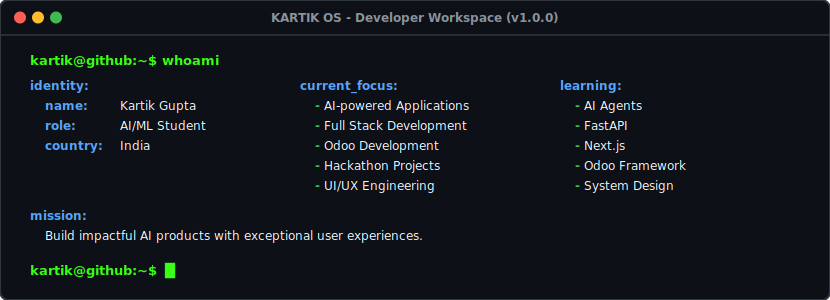

<!-- SECTION 1: HERO BANNER -->
<p align="center">
  
</p>

<p align="center">
  
</p>

### kartik@github:~$ system_trophies --rank
<p align="center">
  
</p>

<!-- SECTION 5: TECH STACK -->
### kartik@github:~$ systemctl status tech-stack

```text
● tech-stack.service - System Technology Stack
     Loaded: loaded (/etc/systemd/system/tech-stack.service; enabled)
     Active: active (running) since Sun 2026-07-12 20:53:05 IST
```

<p align="center">
  <b>Languages</b><br/>
   <b>Python</b> &nbsp;&nbsp;&bull;&nbsp;&nbsp;
   <b>Java</b> &nbsp;&nbsp;&bull;&nbsp;&nbsp;
   <b>JavaScript</b> &nbsp;&nbsp;&bull;&nbsp;&nbsp;
   <b>TypeScript</b>
</p>

<p align="center">
  <b>Frameworks</b><br/>
   <b>Next.js</b> &nbsp;&nbsp;&bull;&nbsp;&nbsp;
   <b>Flutter</b> &nbsp;&nbsp;&bull;&nbsp;&nbsp;
   <b>FastAPI</b> &nbsp;&nbsp;&bull;&nbsp;&nbsp;
   <b>Tailwind</b>
</p>

<p align="center">
  <b>Database</b><br/>
   <b>PostgreSQL</b> &nbsp;&nbsp;&bull;&nbsp;&nbsp;
   <b>Supabase</b>
</p>

<p align="center">
  <b>Tools</b><br/>
   <b>Git</b> &nbsp;&nbsp;&bull;&nbsp;&nbsp;
   <b>GitHub</b> &nbsp;&nbsp;&bull;&nbsp;&nbsp;
   <b>VS Code</b> &nbsp;&nbsp;&bull;&nbsp;&nbsp;
   <b>Figma</b> &nbsp;&nbsp;&bull;&nbsp;&nbsp;
   <b>Framer Motion</b>
</p>

<!-- SECTION 6: CURRENT PROJECTS -->
### kartik@github:~$ project_status --all
```text
PID      PROJECT NAME      TYPE          STATUS
001      SafeRoute AI      AI/ML         RUNNING
002      HireMind AI       Full-Stack    RUNNING
003      EduSensei         AI/ML         BUILDING
004      AssetFlow         Enterprise    COMPLETED
005      Portfolio OS      Frontend      BUILDING
```

<!-- SECTION 8: GITHUB STATS -->
### kartik@github:~$ system_telemetry --stats

<details open>
<summary><b>📊 System Telemetry</b></summary>
<br/>

<p align="center">
  
  &nbsp;
  
</p>

<p align="center">
  
</p>

#### Weekly Contribution Activity
<p align="center">
  
</p>

#### Interactive Grid Animation
<p align="center">
  <picture>
    <source media="(prefers-color-scheme: dark)" srcset="https://raw.githubusercontent.com/KartikGupta06/KartikGupta06/output/github-contribution-grid-snake-dark.svg">
    <source media="(prefers-color-scheme: light)" srcset="https://raw.githubusercontent.com/KartikGupta06/KartikGupta06/output/github-contribution-grid-snake.svg">
    
  </picture>
</p>

</details>

<!-- SECTION 9: CONNECT -->
### kartik@github:~$ establish_connection --secure

[](https://github.com/KartikGupta06)
[](mailto:kartkgupta947@gmail.com)

<!-- SECTION 10: FOOTER -->
---

```text
[ Powered by Kartik OS · v1.0.0 · Build #2026.07.12.01 · © 2026 ]
```
